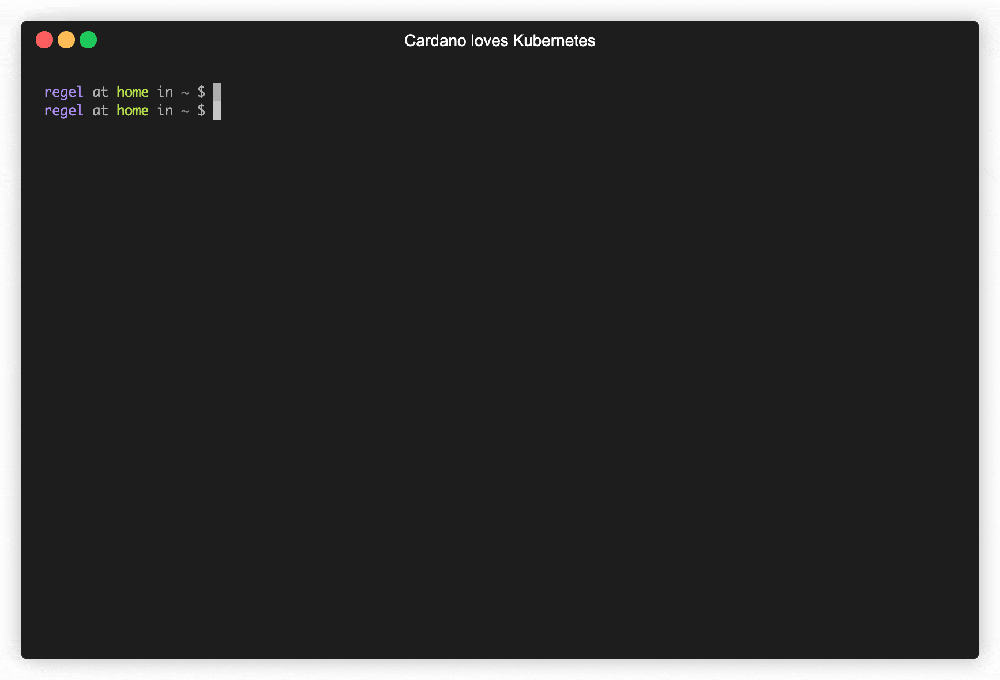

# Cardano Charts

[](https://github.com/regel/cardano-charts/actions/workflows/checkov.yml) [](https://opensource.org/licenses/Apache-2.0)

Contains Helm Charts for operating **the most secure** Cardano nodes in Kubernetes:
- [charts/cardano](./charts/cardano/README.md)

This Chart solves common pain points of Cardano node operations:
- Long bootstrap time for new nodes: this chart can restore testnet or mainnet data at the given epoch using a compressed file archive
- Security measures: combine this chart with Terraform [modules](https://github.com/regel/terraform-azure-cardano) to enforce best security practices in multiple areas (vault, acls, policies, etc)
- Upgrades: facilitate upgrades using infrastructure-as-code best practices

## Backers :dart: :heart_eyes:

Thank you to all our backers! 🙏 [[Become a backer](https://opencollective.com/gh-regel#backer)]

<a href="https://opencollective.com/gh-regel#backers" target="_blank"></a>

## Sponsors :whale:

Support this project by becoming a sponsor. Your logo will show up here with a
link to your website. [[Become a
sponsor](https://opencollective.com/gh-regel#sponsor)]

## Donations in ADA :gem:

Cardano hodlers can send donations to this wallet address: `addr1q973kf48y9vxqareqvxr7flacx3pl3rz0m9lmwt4nej0zr99dw6mre74f2g48nntw5ar6mz58fm09sk70e0k4vgmkess27g47n`

## Demo



## Security Measures Every Stake Pool Operator Should Implement

Refer to the Cardano forum [guide](https://forum.cardano.org/t/back-to-basics-security-measures-every-cardano-stake-pool-operators-should-know-and-implement/38166) for keys and secrets management.

### How This Cardano Helm Chart Implements Security Guidelines

This Cloud Native Helm Chart leverages advanced security features provided in Kubernetes and Cloud vendors extensions. :rotating_light: Ensure that you understand these concepts before using this Chart:

- [Calico](https://docs.microsoft.com/en-us/azure/aks/use-network-policies) plugin: see how this network plugin in Kubernetes enforces `ingress` and `egress` traffic between pods and external IPs using [Network Policies](https://kubernetes.io/docs/concepts/services-networking/network-policies/)
- Watch this [KubeCon](https://www.youtube.com/watch?v=3gGpMmYeEO8) talk or check out the recipes on [Network Policies](https://github.com/ahmetb/kubernetes-network-policy-recipes). Credits: Ahmet Balkan, Google
- Key Vault: all secret keys required to run a Cardano node are stored inside a Vault and only mounted where the least access privilege applies. The Azure Vault used in this Chart requires the configuration of a [User Assigned Managed Identity](https://docs.microsoft.com/en-us/azure/active-directory/managed-identities-azure-resources/overview)
- Run As NonRoot and set root filesystems Read-Only: Containers run using non-root users according to best Docker practices

## Frequently Asked Questions :question:

### How can Cardano Charts be so Awesome?

Help me grow this project by becoming a backer and making a [[donation](https://opencollective.com/gh-regel#backer)]

### Where Can I Find Documentation on Azure Key Vault?

Here: [Azure Key Vault](https://docs.microsoft.com/en-us/azure/key-vault/general/basic-concepts)

### Storing Cold Keys in Luna HSM when Using Azure Key Vault? 

[Microsoft](https://azure.microsoft.com/): [[Become a sponsor](https://opencollective.com/gh-regel#sponsor)]

To use Azure HSM for key storage and signature, two things must happen first:

- Azure Key Vault must add support for the [ed25519](https://fr.wikipedia.org/wiki/Curve25519) crypto algorithm used in Cardano. At this time, the current generation of managed HSM hardware does not seem to support it yet
- `cardano-cli` or another tool must be able to sign Tx raw transactions using the Azure Key Vault [REST API](https://docs.microsoft.com/en-us/rest/api/keyvault/)

### Where Can I Find Documentation on Network Policies?

[Tigera](https://tigera.io): [[Become a sponsor](https://opencollective.com/gh-regel#sponsor)]

Tigera web site is a good place to start reading about [Calico](https://docs.projectcalico.org/reference/public-cloud/azure). Also, check their [Definitive guide to container networking, security, and troubleshooting](https://www.tigera.io/lp/calico-open-source-white-paper/)

### Can You Add Support For Other Vaults And Other Cloud Vendors?

See [CONTRIBUTING](./CONTRIBUTING.md).

### Where To File Issues?

If you are a vulnerability reporter (for example, a security researcher) who would like to report a vulnerability, first contact me privately via the Telegram link below.

Other issues can be reported on Github.

### How to Contact?

Chat :speech_balloon: with me on [Telegram](https://t.me/ghregel)

### Want to Offer A Dream Job? :necktie:

You know the saying, anything is possible. Just know that I am in Geneva, CH, and therefore I have high expectations. :four_leaf_clover:

## Documentation

The README documentation is generated by [helm-docs](https://github.com/norwoodj/helm-docs)

### Deploy Using Terraform

You may find useful resources below:

- [terraform-azure-cardano](https://github.com/regel/terraform-azure-cardano): This repo contains a set of modules in the [modules folder](https://github.com/regel/terraform-azure-cardano/tree/main/modules) for deploying a Cardano node on [Azure](https://portal.azure.com/) using [Terraform](https://www.terraform.io/). 

#### Running this Helm Chart :rocket: the hard way

Install the Azure Key Vault provider:

```
helm repo add https://raw.githubusercontent.com/Azure/secrets-store-csi-driver-provider-azure/master/charts
helm install csi-secrets-store-provider-azure/csi-secrets-store-provider-azure --generate-name --set secrets-store-csi-driver.syncSecret.enabled=true --namespace kube-system
```

Create a Kubernetes [secret](https://kubernetes.io/fr/docs/concepts/configuration/secret/) to secure internal Redis communication:

```
kubectl create secret generic redis-secret --from-literal=redis-username='cardano' --from-literal=redis-password='S!B\*d$zDsb'
```

Customize the options as needed, and install this Chart:

```
helm repo add cardano https://regel.github.io/cardano-charts
helm upgrade --install pool \
  --values cardano/values.yaml \
  --set redis.auth.existingSecret=redis-secret \
  --set vault.csi.enabled=false \
  --set producer.enabled=false \
    cardano/cardano
```

#### Query the Blockchain Tip :rocket:

Change the pod namespace and `cardano-cli` options according to the chain id, chart namespace and release name, and run:

```
kubectl exec -ti -n mainnet mainnet-cardano-relay-0 -c node -- cardano-cli query tip --mainnet
```

On testnet, run:

```
kubectl exec -ti -n testnet testnet-cardano-relay-0 -c node -- cardano-cli query tip --testnet-magic 1097911063
```
